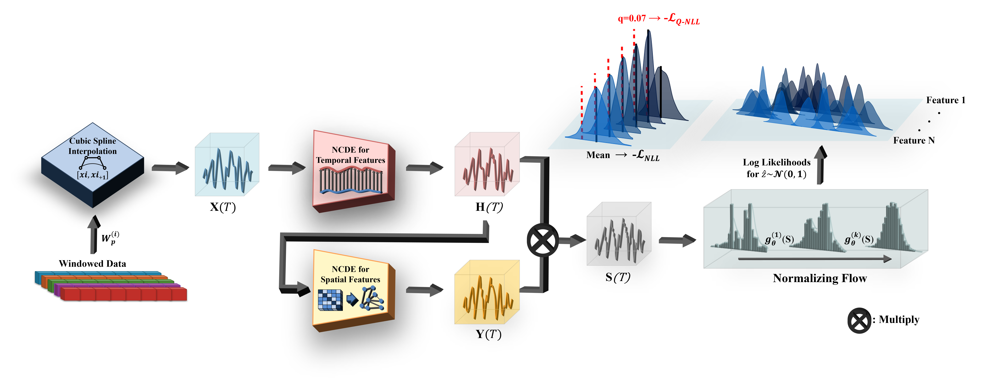
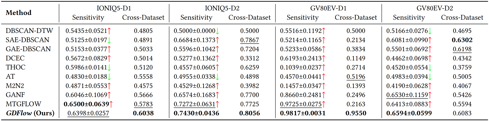

# GDFlow
This repository contains the source code for our paper 'Anomaly Detection for Advanced Driver Assistance System with NCDE-based Normalizing Flow'.

## Model Architecture



## Experiment Results

Anomaly detection performance evaluation on individual and cross-deceleration datasets.  
- The best performance is **highlighted in bold**.  
- The second-best performance is _underlined_.  



## Installation

This code was developed using the following environment:
- Python 3.10.13
- NumPy 1.26.2
- SciPy 1.11.4
- PyTorch 1.12.1
- CUDA 11.3
- torchdiffeq 0.2.4

To install all the required dependencies, run the following command:

```bash
pip3 install -r requirements.txt
```

## Training and Testing

Our experiments can be performed on the **SMD (Machine-1-4 and Machine-2-1)**, **MSL (P-15)**, and **SMAP (T-3)** benchmark datasets using the following commands:

```bash
bash runners/run_SMD_1.sh
bash runners/run_SMD_2.sh
bash runners/run_MSL.sh
bash runners/run_SMAP.sh
```
